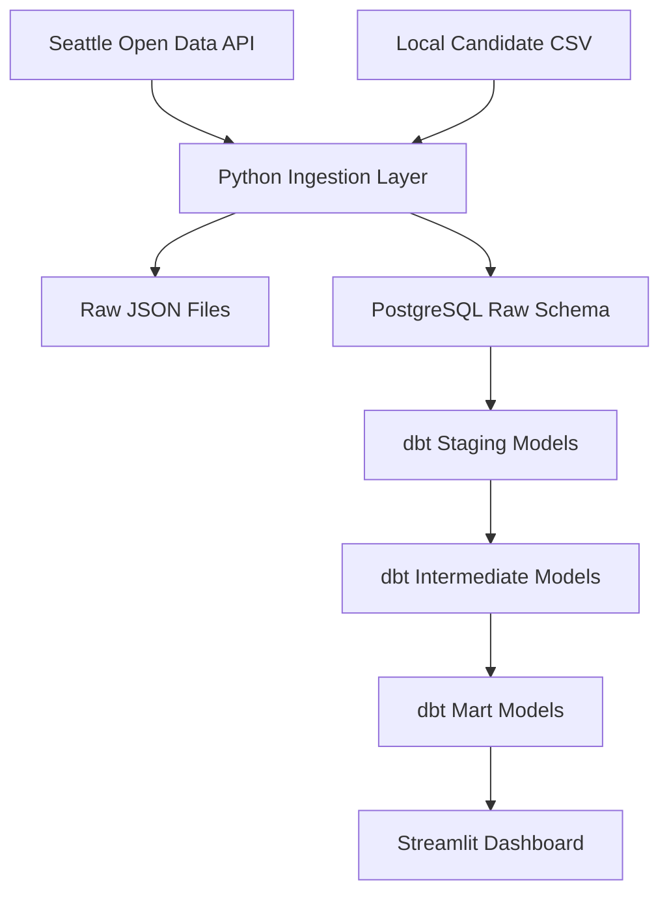

# Seattle-Area Rental Intelligence Platform

I built this after noticing that listing sites didn't answer some practical questions I had while apartment hunting in the Seattle area — things like whether a building had recent code complaints, whether there was active construction nearby, or whether a property was registered as a rental. This project pulls that public-record context together into a Python + PostgreSQL + dbt + Streamlit pipeline.

## What It Does

- Ingests building permits, code violations, and rental registration data from Seattle's Open Data API (Socrata)
- Stores raw API responses as JSONB in PostgreSQL
- Transforms data through dbt staging, intermediate, and mart layers (70 tests)
- Matches each candidate apartment to nearby complaints and permits within 500m using manually verified coordinates
- Tracks which jurisdiction each apartment is in (Seattle vs. Shoreline) so Shoreline candidates aren't penalized for missing Seattle-specific records
- Presents everything in a Streamlit dashboard where every count can be traced to source records

## Architecture



| Layer | Technology |
|-------|------------|
| Language | Python 3.11+ |
| Ingestion | Custom Socrata API client, requests |
| Warehouse | PostgreSQL 15 with PostGIS Docker image |
| Transformation | dbt Core |
| Dashboard | Streamlit |
| Infrastructure | Docker Compose |
| Testing | pytest, dbt tests |

## Dashboard

```bash
make dashboard
# Opens at http://localhost:8501
```

| Page | Purpose |
|------|---------|
| Executive Summary | How many candidates, how many in Seattle vs. Shoreline, total nearby complaints/permits |
| Apartment Comparison | Side-by-side table with filters |
| Apartment Detail | Everything about one apartment, with flags explained |
| Public Record Evidence | The actual complaint and permit records behind the counts |
| Methodology & Limitations | How the pipeline works and what it doesn't cover |

The dashboard only reads from dbt mart tables — it doesn't recalculate anything.

## Quick Start

```bash
# 1. Configure
cp .env.example .env         # Edit with your PostgreSQL credentials
docker compose up -d          # Start PostgreSQL (or use local install)

# 2. Install dependencies
make setup

# 3. Ingest public data from Seattle Open Data
make ingest

# 4. Load candidate apartments
make validate-candidates
make load-candidates

# 5. Build dbt models
make dbt-run
make dbt-test

# 6. Launch dashboard
make dashboard
```

## Data Privacy

- **Public demo data** (`candidate_apartments.example.csv`) is committed so the project is runnable by anyone
- **Real search notes** (`candidate_apartments.local.csv`) are gitignored and never committed
- **No scraping** — candidate data is manually curated; public data comes from official government APIs only
- **Risk flags are due-diligence signals**, not legal conclusions — missing records do not imply a property is unsafe or illegal

## Data Sources

| Source | Provider | Dataset ID | Purpose |
|--------|----------|-----------|---------|
| Building Permits | City of Seattle Open Data | `76t5-zqzr` | Nearby construction activity |
| Code Violations | City of Seattle Open Data | `ez4a-iug7` | Nearby complaint/violation signals |
| Rental Registration | City of Seattle Open Data | `j2xh-c7vt` | Registration matching |
| Candidate Apartments | Manually curated (local CSV) | — | Core apartment candidates |

## Limitations

- Seattle datasets do not fully cover Shoreline or other nearby cities
- Current ingestion is sample-limited (1,000 most recent rows per dataset)
- Registration non-match is not a legal conclusion — only means not found in current sample with current matching logic
- Proximity matching uses approximate distance; PostGIS is a future upgrade
- Dashboard is read-only

## Future Improvements

- PostGIS spatial joins for geodesic precision
- Full-data ingestion mode beyond 1,000-row samples
- Shoreline / King County public data integration
- Airflow orchestration (stub DAG exists; not required for the current Makefile-based pipeline)
- Cloud deployment

## Documentation

- [Project Story](docs/project_story.md) — Personal motivation
- [Architecture](docs/architecture.md) — System design and data flow
- [Data Sources](docs/data_sources.md) — Source details and API documentation
- [Data Dictionary](docs/data_dictionary.md) — Field definitions across all layers
- [Scoring Methodology](docs/scoring_methodology.md) — How risk flags work
- [Privacy & Data Use](docs/privacy_and_data_use.md) — Data collection and responsible use
- [Validation Notes](docs/validation_notes.md) — Proximity evidence validation
- [Portfolio Summary](docs/portfolio_summary.md) — For recruiters and interviewers
- [Future Improvements](docs/future_improvements.md) — Roadmap

## License

This project is for educational and portfolio purposes.
