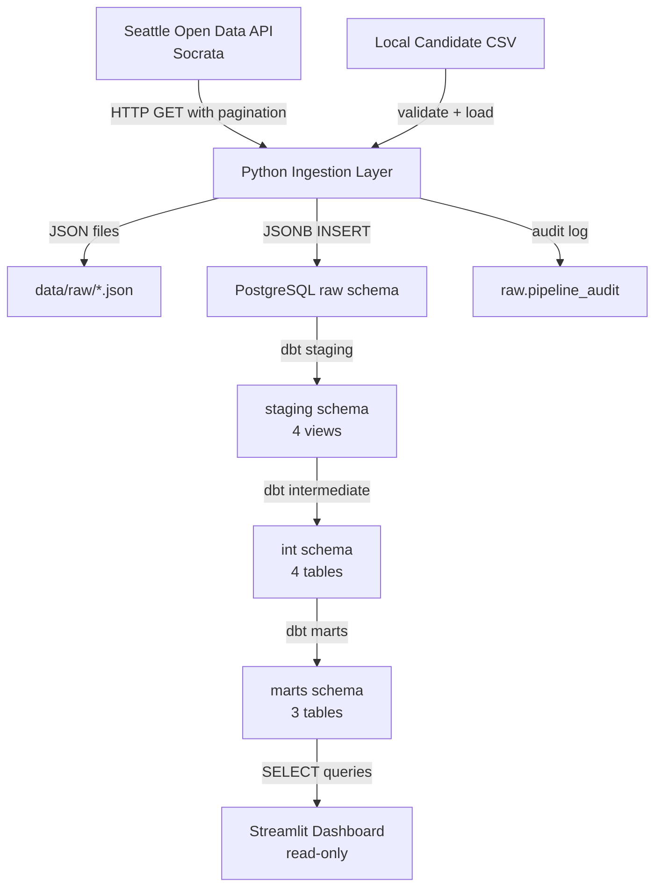

# Seattle-Area Rental Intelligence Platform — Project Audit Report

Generated: 2026-06-24

---

## 1. Project Identity

**Project name:** Seattle-Area Rental Intelligence Platform

**Summary:** A Python + PostgreSQL + dbt + Streamlit data engineering pipeline that ingests public records from the City of Seattle's Open Data API (Socrata) — building permits, code violations, and rental property registration — and cross-references them against a small set of manually curated apartment candidates from a real apartment search. The output is a Streamlit dashboard where every complaint count, permit count, and registration match is traceable to individual source records with verified distances.

**What real problem it solves:** Apartment listing websites show rent, photos, and amenities, but they do not surface nearby code complaints, active construction permits, or rental registration status. This platform fills that information gap by pulling public-record context together so a renter can make a more informed decision before signing a lease.

**Why Seattle-area, not Seattle-only:** The creator's actual apartment search spanned both Seattle and Shoreline. Seattle has rich open data through its Socrata portal, but Shoreline is a separate jurisdiction not covered by Seattle city datasets. The platform tracks jurisdiction per apartment so Shoreline candidates are flagged for partial data coverage rather than being penalized for missing Seattle records. This jurisdiction-aware design is a deliberate engineering decision, not an oversight.

**Current project status:** Functionally complete as an MVP. Pipeline runs end-to-end, dbt models produce traceable results, dashboard renders five pages, all 56 Python tests pass and 70 dbt tests are defined. Ready for dashboard screenshots and GitHub publication after privacy review.

---

## 2. Current Milestone Status

| Milestone | Status | What Was Completed | Evidence / Verification |
|-----------|--------|-------------------|------------------------|
| Initial project skeleton | Complete | Repository structure, Makefile, docker-compose, requirements.txt, .env.example, .gitignore | All files present and functional |
| Seattle Open Data ingestion | Complete | Reusable Socrata API client with pagination, retry, and timeout; extraction for 3 datasets; raw JSON file storage; JSONB loading into PostgreSQL; pipeline audit logging | `src/ingestion/socrata_client.py`, `extract_public_datasets.py`, `load_to_postgres.py`; 20 tests covering client, extraction, and audit |
| Multi-source ingestion | Complete | Building permits, code violations, and rental registration all extracted and loaded via config-driven pipeline | `datasets.yml` with 3 enabled Socrata datasets; `run_pipeline.py` orchestrates extract → load → audit |
| Candidate apartment loading | Complete | CSV validation with 15+ checks, file resolution (local → example), loader with typed parsing | `validate_candidates.py`, `load_candidates.py`; 22 tests covering validation edge cases |
| dbt staging / intermediate / mart | Complete | 4 staging models, 4 intermediate models, 3 mart models; 70 dbt tests defined across schema.yml files | All 11 dbt model SQL files present with schema tests |
| Business rule fixes | Complete | Jurisdiction-aware registration wording, flag grouping (public record / coverage / renter fit), budget excluded from due-diligence totals | Verified in `mart_apartment_due_diligence.sql` |
| Seattle-area / jurisdiction-aware scope | Complete | `jurisdiction` field (seattle / shoreline / other_king_county / unknown), `public_data_coverage_level`, `data_coverage_status`, jurisdiction-conditional flag logic | `int_candidate_apartment_base.sql` lines 66–95 |
| Coordinate completion | Complete | All candidates have manually verified lat/lng; `has_coordinates` and `coordinate_quality_note` fields; `coordinate_status.py` helper | Example CSV has coordinates for all 7 demo rows; proximity validation doc confirms 5 local candidates verified |
| Proximity evidence validation | Complete | Every complaint/permit count traced to individual records with distances; evidence marts (`mart_nearby_complaint_evidence`, `mart_nearby_permit_evidence`) | `docs/proximity_validation.md` with per-apartment evidence tables |
| Streamlit dashboard MVP | Complete | 5 pages: Executive Summary, Apartment Comparison, Apartment Detail, Public Record Evidence, Methodology & Limitations | `dashboard/app.py` (398 lines), `db.py`, `formatting.py` |
| Portfolio polish | Complete | 14 documentation files covering architecture, data sources, scoring, privacy, resume bullets, interview talking points, candidate data guide | All docs present in `docs/` directory |
| Authenticity wording pass | Complete | Registration non-match says "not matched in current sample" not "unregistered"; Shoreline says "not applicable" not "not found"; flags split into three groups | Verified in mart SQL and dashboard code |

---

## 3. Repository Structure

```
Seattle-Area Rental Intelligence Platform/
├── Makefile                          # Build commands
├── README.md                         # Project overview and quick start
├── requirements.txt                  # Python dependencies
├── docker-compose.yml                # PostgreSQL (PostGIS) container
├── .env.example                      # Environment variable template
├── .gitignore                        # Privacy and build artifact exclusions
│
├── src/                              # Python source code
│   ├── ingestion/                    # Data extraction and loading
│   │   ├── socrata_client.py         # Reusable Socrata API client
│   │   ├── extract_public_datasets.py # Dataset extraction with JSON storage
│   │   ├── load_to_postgres.py       # JSONB loading and audit logging
│   │   ├── load_candidates.py        # CSV → PostgreSQL candidate loader
│   │   ├── validate_candidates.py    # CSV validation (15+ checks)
│   │   ├── coordinate_status.py      # Coordinate completeness checker
│   │   ├── run_pipeline.py           # Pipeline orchestrator
│   │   └── datasets.yml              # Dataset configuration
│   ├── matching/                     # Address normalization (stub)
│   │   ├── normalize_address.py      # Placeholder for future fuzzy matching
│   │   └── geocode_candidates.py     # Placeholder for future geocoding
│   ├── scoring/                      # Scoring logic (stub)
│   │   ├── rental_fit_score.py       # Placeholder for future fit scoring
│   │   └── risk_flags.py             # Placeholder for future Python-side flags
│   └── utils/
│       ├── database.py               # PostgreSQL connection, schema creation
│       └── logging_config.py         # Structured logging setup
│
├── dbt/                              # dbt Core project
│   ├── dbt_project.yml               # Project config (name, schemas, materialization)
│   ├── profiles.yml                  # Database connection profile
│   ├── macros/
│   │   └── generate_schema_name.sql  # Schema naming override
│   ├── models/
│   │   ├── sources/
│   │   │   └── sources.yml           # Raw source definitions (4 tables)
│   │   ├── staging/                  # 4 staging models + schema.yml
│   │   │   ├── stg_building_permits.sql
│   │   │   ├── stg_code_violations.sql
│   │   │   ├── stg_rental_registration.sql
│   │   │   ├── stg_candidate_apartments.sql
│   │   │   └── schema.yml
│   │   ├── intermediate/             # 4 intermediate models + schema.yml
│   │   │   ├── int_candidate_apartment_base.sql
│   │   │   ├── int_rental_registration_matches.sql
│   │   │   ├── int_code_violations_near_candidates.sql
│   │   │   ├── int_building_permits_near_candidates.sql
│   │   │   └── schema.yml
│   │   └── marts/                    # 3 mart models + schema.yml
│   │       ├── mart_apartment_due_diligence.sql
│   │       ├── mart_nearby_complaint_evidence.sql
│   │       ├── mart_nearby_permit_evidence.sql
│   │       └── schema.yml
│   └── tests/                        # Empty (all tests in schema.yml)
│
├── dashboard/                        # Streamlit application
│   ├── app.py                        # Main dashboard (398 lines, 5 pages)
│   ├── db.py                         # Database queries (3 mart queries)
│   ├── formatting.py                 # Label and display helpers
│   ├── __init__.py
│   └── README.md                     # Dashboard usage guide
│
├── data/
│   ├── seed/
│   │   ├── candidate_apartments.example.csv  # 7 demo apartments (committed)
│   │   └── personal_preferences.yml          # Search preferences and hard filters
│   └── raw/                          # Raw API JSON files (gitignored)
│
├── tests/                            # Python test suite
│   ├── test_socrata_client.py        # API client tests (8 tests)
│   ├── test_extraction.py            # Extraction logic tests (10 tests)
│   ├── test_dataset_config.py        # Config validation tests (8 tests)
│   ├── test_load_candidates.py       # Candidate loading tests (22 tests)
│   ├── test_pipeline_audit.py        # Audit logging tests (5 tests)
│   ├── test_database.py              # Table name validation tests (2 tests)
│   └── (empty test stubs removed; future work documented in docs/future_improvements.md)
│
├── docs/                             # Project documentation (14 files)
│   ├── project_story.md
│   ├── architecture.md
│   ├── data_sources.md
│   ├── data_dictionary.md
│   ├── data_quality.md
│   ├── scoring_methodology.md
│   ├── privacy_and_data_use.md
│   ├── validation_notes.md
│   ├── proximity_validation.md
│   ├── candidate_data_collection_guide.md
│   ├── future_improvements.md
│   ├── portfolio_summary.md
│   ├── resume_bullets.md
│   ├── interview_talking_points.md
│   ├── validation_queries.sql
│   └── screenshots/
│       └── README.md                 # Screenshot capture instructions
│
├── airflow/
│   └── dags/
│       └── rental_intelligence_pipeline.py  # Stub (empty DAG file)
│
└── .github/
    └── workflows/
        └── ci.yml                    # GitHub Actions: lint + pytest
```

### Folder Summary

| Folder | Purpose |
|--------|---------|
| `src/ingestion/` | Socrata API client, dataset extraction, PostgreSQL loading, candidate validation, pipeline orchestration |
| `src/matching/` | Stubs for address normalization and geocoding (not yet implemented in Python; matching done in dbt SQL) |
| `src/scoring/` | Stubs for fit scoring and risk flags (not yet implemented in Python; flags are computed in dbt SQL) |
| `src/utils/` | Database connection management, logging configuration |
| `dbt/models/` | 11 SQL models across staging, intermediate, and mart layers with schema-defined tests |
| `dashboard/` | Streamlit app with 5 pages, database query helpers, and formatting utilities |
| `data/seed/` | Example candidate CSV (committed) and personal preferences YAML |
| `data/raw/` | Raw API JSON output (gitignored) |
| `tests/` | 56 passing Python tests covering API client, extraction, validation, audit, and config |
| `docs/` | 14 documentation files covering architecture, data sources, methodology, privacy, and portfolio materials |
| `airflow/dags/` | Placeholder DAG file (orchestration not yet implemented) |
| `.github/workflows/` | CI pipeline (lint + test) |

---

## 4. Makefile Commands

| Command | What It Does | When to Run | Required? |
|---------|-------------|-------------|-----------|
| `make setup` | Installs Python dependencies from `requirements.txt` | First-time setup | Yes |
| `make ingest` | Runs the full ingestion pipeline: extract from Socrata APIs → save raw JSON → load JSONB into PostgreSQL → log audit | After database is running; whenever you want fresh public data | Yes |
| `make validate-candidates` | Validates the candidate apartment CSV (checks required fields, types, ranges, coordinates, accepted values) | Before loading candidates; after editing the CSV | Yes |
| `make load-candidates` | Validates then loads candidate apartments from CSV into `raw.raw_candidate_apartments` (depends on `validate-candidates`) | After validation passes | Yes |
| `make coordinate-status` | Shows which candidates have/are missing lat/lng coordinates (read-only) | Anytime, to check coordinate completeness | Optional |
| `make dbt-run` | Runs all dbt models (staging → intermediate → marts) | After data is loaded into raw tables | Yes |
| `make dbt-test` | Runs all 70 dbt schema tests | After dbt-run; to verify data quality | Yes |
| `make test` | Runs the Python test suite via pytest | During development or CI | Optional locally |
| `make dashboard` | Launches the Streamlit dashboard at `http://localhost:8501` | After dbt models are built | Yes (for viewing) |
| `make lint` | Runs flake8 on `src/` and `tests/` | During development or CI | Optional |
| `make clean` | Deletes all files in `data/raw/` except `.gitkeep` | When you want to clear raw API output | Optional |

---

## 5. Dependencies and Environment

### Python Libraries

| Category | Libraries |
|----------|-----------|
| Core | `requests`, `pyyaml`, `python-dotenv` |
| Database | `psycopg2-binary`, `sqlalchemy` |
| dbt | `dbt-core`, `dbt-postgres` |
| Dashboard | `streamlit`, `pandas`, `plotly` |
| Orchestration | Makefile-based (Airflow is planned future work; see `requirements-airflow.txt`) |
| Testing | `pytest` |
| Code quality | `flake8` |

### Database

- PostgreSQL 15 (via Docker), using the `postgis/postgis:15-3.4` image
- PostGIS extension is available in the image but not actively used by current SQL models
- Database name: `seattle_rental`

### Docker Services

`docker-compose.yml` defines one service:

- `postgres` — PostGIS-enabled PostgreSQL 15.x with health check, persistent volume (`pgdata`), port 5432

### Environment Variables

From `.env.example`:

| Variable | Purpose | Default |
|----------|---------|---------|
| `POSTGRES_HOST` | Database host | `localhost` |
| `POSTGRES_PORT` | Database port | `5432` |
| `POSTGRES_DB` | Database name | `seattle_rental` |
| `POSTGRES_USER` | Database user | `rental_user` |
| `POSTGRES_PASSWORD` | Database password | (must be set) |
| `SOCRATA_APP_TOKEN` | Optional Socrata API token (higher rate limits) | (empty) |
| `DBT_PROFILES_DIR` | dbt profiles location | `./dbt` |
| `AIRFLOW_HOME` | Airflow home directory | `./airflow` |
| `STREAMLIT_SERVER_PORT` | Dashboard port | `8501` |

---

## 6. Data Sources

### Public Datasets (from Seattle Open Data / Socrata)

| Source Name | Dataset ID | Domain | Raw Table | Purpose | Row Limit | Key Limitation |
|-------------|-----------|--------|-----------|---------|-----------|----------------|
| Building Permits — Current | `76t5-zqzr` | data.seattle.gov | `raw_building_permits` | Identify nearby construction and development activity near candidate apartments | 1,000 most recent (ordered by `issueddate DESC`, lookback 365 days) | Sample-limited; older permits not captured |
| Code Violations | `ez4a-iug7` | data.seattle.gov | `raw_code_violations` | Identify complaint or violation signals near candidate apartments | 1,000 most recent (ordered by `opendate DESC`, lookback 730 days) | Sample-limited; covers Seattle only |
| Rental Property Registration | `j2xh-c7vt` | data.seattle.gov | `raw_rental_registration` | Check whether candidate apartments can be matched to rental registration records | 1,000 most recent (ordered by `registereddate DESC`) | Address matching is exact normalized string; abbreviation differences cause misses |
| Neighborhood Boundaries | `neighborhood-map-atlas-neighborhoods` | Seattle GeoData (ArcGIS) | `raw_neighborhoods` | Support neighborhood-level aggregation (future) | N/A | **Disabled** — GeoJSON format requires different ingestion logic |

### Candidate Apartments

- Manually curated from the project owner's apartment search notes
- **Not scraped** from any commercial listing platform (Zillow, Apartments.com, Google Maps, etc.)
- Coordinates are manually verified from public sources (King County Parcel Viewer, city GIS portals)
- Two file types:
  - `candidate_apartments.example.csv` — 7 fictional demo apartments (committed to git)
  - `candidate_apartments.local.csv` — Real search notes (gitignored, never committed)
- The loader automatically prefers the local file over the example file

---

## 7. Data Pipeline Flow

### Architecture Diagram



### Step-by-Step Pipeline

**1. Public API Extraction**

- `SocrataClient` makes HTTP GET requests to `https://data.seattle.gov/resource/{dataset_id}.json`
- Pagination via `$limit` and `$offset` parameters (page size: 1,000)
- Retry logic: 3 attempts with exponential backoff (2s, 4s, 8s) for HTTP 429, 5xx, connection errors, and timeouts
- Timeout: 30 seconds per request
- Optional `$where` clause filters by date (e.g., `issueddate >= '2025-06-24T00:00:00'`)
- Raw JSON responses saved to `data/raw/{dataset_key}_{timestamp}.json`

**2. PostgreSQL Raw Layer**

- Schema: `raw`
- Raw tables use JSONB storage: `id SERIAL, source_dataset TEXT, ingested_at TIMESTAMP, raw_record JSONB`
- Tables: `raw_building_permits`, `raw_code_violations`, `raw_rental_registration`, `raw_candidate_apartments`
- `raw_candidate_apartments` is a structured table (not JSONB) loaded from CSV
- Pipeline audit table: `raw.pipeline_audit` tracks run timestamps, row counts, status, and errors per dataset

**3. Candidate Workflow**

- File resolution: env var → `candidate_apartments.local.csv` → `candidate_apartments.example.csv`
- Validation checks: required columns, not-null fields, unique IDs, numeric rent, coordinate bounds (47.3–47.9 lat, -122.6 to -122.0 lng), accepted values for 6 enum fields, placeholder detection, cross-field consistency
- Loading: `DROP TABLE IF EXISTS` + `CREATE TABLE` + row-by-row `INSERT` with typed parsing
- Coordinate validation: separate `make coordinate-status` command shows completeness without modifying data

**4. dbt Transformation Layer**

| Layer | Schema | Materialization | Models | Purpose |
|-------|--------|----------------|--------|---------|
| Staging | `staging` | View | 4 | Extract fields from JSONB, clean, type, rename |
| Intermediate | `int` | Table | 4 | Jurisdiction logic, address matching, proximity calculations, hard-filter evaluation |
| Marts | `marts` | Table | 3 | Apartment-level due-diligence profiles and individual evidence records |

**5. Dashboard**

- Reads from 3 PostgreSQL mart tables via SQLAlchemy
- Caches data for 300 seconds
- Read-only: no writes, no business logic reimplementation
- All flags and counts come from dbt, not dashboard code

---

## 8. Database Schemas and Tables

### Raw Schema (`raw`)

| Table | Type | Description |
|-------|------|-------------|
| `raw_building_permits` | JSONB table | Building permits from Socrata API |
| `raw_code_violations` | JSONB table | Code complaints/violations from Socrata API |
| `raw_rental_registration` | JSONB table | Rental registrations from Socrata API |
| `raw_candidate_apartments` | Structured table | Candidate apartments from CSV |
| `pipeline_audit` | Structured table | Ingestion run tracking (timestamps, row counts, status, errors) |

### Staging Schema (`staging`)

| Model | Type | Source | Description |
|-------|------|--------|-------------|
| `stg_building_permits` | View | `raw_building_permits` | Extracts permit fields from JSONB (permit_number, address, status, dates, coordinates) |
| `stg_code_violations` | View | `raw_code_violations` | Extracts violation fields from JSONB (record_number, address, status, open_date, coordinates) |
| `stg_rental_registration` | View | `raw_rental_registration` | Extracts registration fields from JSONB (registration_id, address, property_name, status) |
| `stg_candidate_apartments` | View | `raw_candidate_apartments` | Cleans candidate fields, normalizes address to `UPPER(TRIM(address))` |

### Intermediate Schema (`int`)

| Model | Type | Description |
|-------|------|-------------|
| `int_candidate_apartment_base` | Table | Adds jurisdiction, data coverage, coordinate status, hard-filter evaluation, candidate status |
| `int_rental_registration_matches` | Table | Left-joins candidates to registrations by normalized address; produces match/no_match with confidence |
| `int_code_violations_near_candidates` | Table | Cross-join with bounding-box pre-filter + 500m distance; aggregates complaint counts per apartment |
| `int_building_permits_near_candidates` | Table | Cross-join with bounding-box pre-filter + 500m distance; aggregates permit counts per apartment |

### Marts Schema (`marts`)

| Model | Type | Description |
|-------|------|-------------|
| `mart_apartment_due_diligence` | Table | One row per apartment: all fields, registration match, nearby counts, 9 boolean flags, 4 grouped flag totals |
| `mart_nearby_complaint_evidence` | Table | Individual complaint records within 500m of each apartment (apartment_id, record_number, address, date, status, distance) |
| `mart_nearby_permit_evidence` | Table | Individual permit records within 500m of each apartment (apartment_id, permit_number, address, date, status, distance) |

---

## 9. dbt Project Summary

| Property | Value |
|----------|-------|
| Project name | `seattle_rental_intelligence` |
| Version | 1.0.0 |
| Profile | `seattle_rental_intelligence` |
| Total models | 11 |
| Staging models | 4 (views) |
| Intermediate models | 4 (tables) |
| Mart models | 3 (tables) |
| Source definitions | 1 source (`raw`) with 4 tables |
| Total dbt tests | 70 (defined in 3 schema.yml files) |
| Custom tests | 0 (all tests are schema-based: `not_null`, `unique`, `accepted_values`) |

### Final Marts Detail

#### `mart_apartment_due_diligence`

- **Purpose:** Apartment-level due-diligence profile with jurisdiction-aware flags, grouped flag counts, hard-filter evaluation, and candidate status
- **Key columns:** `apartment_id`, `apartment_name`, `jurisdiction`, `public_data_coverage_level`, `consideration_status`, `include_in_final_comparison`, `rental_registration_match`, `registration_match_note`, `complaints_nearby_count`, `permits_nearby_count`, 9 individual `flag_*` columns, 4 `total_*_flags` columns
- **Row count:** Matches number of candidate apartments (7 for example data, 5 for local data per validation docs)
- **Downstream use:** Primary data source for all 5 dashboard pages

#### `mart_nearby_complaint_evidence`

- **Purpose:** Individual complaint records within 500m of each candidate, for evidence display and traceability
- **Key columns:** `apartment_id`, `apartment_name`, `jurisdiction`, `record_number`, `complaint_address`, `complaint_open_date`, `complaint_status`, `complaint_type`, `complaint_description`, `estimated_distance_meters`
- **Row count:** 22 total (per validation docs with local data: Modera 6, Augusta 8, Arista 8, Verdant 0, Canopy 0)
- **Downstream use:** Public Record Evidence page in dashboard

#### `mart_nearby_permit_evidence`

- **Purpose:** Individual permit records within 500m of each candidate, for evidence display and traceability
- **Key columns:** `apartment_id`, `apartment_name`, `jurisdiction`, `permit_number`, `permit_address`, `issued_date`, `permit_status`, `permit_type`, `permit_description`, `estimated_distance_meters`
- **Row count:** 11 total (per validation docs with local data: Modera 4, Augusta 2, Arista 3, Verdant 2, Canopy 0)
- **Downstream use:** Public Record Evidence page in dashboard

---

## 10. Business Rules

### Candidate Eligibility

| Field | Values | Logic |
|-------|--------|-------|
| `consideration_status` | `eligible`, `rejected`, `benchmark` | Set in candidate CSV; defaults to `eligible` |
| `include_in_final_comparison` | `true`, `false` | Set in candidate CSV; defaults to `true` |
| `meets_budget_requirement` | boolean | `true` if `listed_rent <= 2500` |
| `meets_unit_type_requirement` | boolean | `true` if `unit_type = '1B1B'` |
| `meets_hard_filters` | boolean | `true` if both budget and unit type pass |

### Jurisdiction

| Value | Condition |
|-------|-----------|
| `seattle` | `UPPER(TRIM(city)) = 'SEATTLE'` |
| `shoreline` | `UPPER(TRIM(city)) = 'SHORELINE'` |
| `other_king_county` | `city IS NOT NULL` but not Seattle or Shoreline |
| `unknown` | `city IS NULL` |

### Coverage Levels

| Value | Meaning |
|-------|---------|
| `seattle_city_open_data_available` | Full coverage from Seattle Open Data |
| `shoreline_partial_manual_review` | Seattle datasets do not apply; manual review needed |
| `king_county_context_possible` | County-level data may be available separately |
| `unknown_or_not_configured` | Jurisdiction not determined |

Coverage limitations are separated from risk — a Shoreline coverage flag does not count as a property problem.

### Registration Matching

| Scenario | `registration_match_note` |
|----------|--------------------------|
| Matched (any jurisdiction) | "Matched to Seattle rental registration data using normalized address" |
| Shoreline candidate | "Seattle rental registration data is not applicable because this candidate is in Shoreline..." |
| Other non-Seattle | "Seattle rental registration data is not applicable for {city}..." |
| Seattle, not matched | "Not matched in current Seattle rental registration sample using normalized-address matching. This is a due-diligence signal, not a legal conclusion" |

### Availability Flags

| Flag | Condition |
|------|-----------|
| `flag_availability_mismatch` | Both `online_availability_status` and `actual_availability_status` are non-null and differ (case-insensitive) |
| `flag_availability_unclear` | Either status is `'unclear'` |

### Parking Flags

| Flag | Condition |
|------|-----------|
| `flag_parking_unclear` | `parking_available` is null or empty string |
| `flag_parking_unavailable` | `parking_available = 'no'` |

### Coordinates

| Field | Logic |
|-------|-------|
| `has_coordinates` | `true` if both latitude and longitude are non-null |
| `coordinate_quality_note` | Explains whether proximity matching is enabled or unavailable |

### Proximity

- Search radius: **500 meters**
- Distance formula: flat-earth approximation at Seattle latitude (~47.6°N): `sqrt((Δlat × 111000)² + (Δlng × 75000)²)`
- Bounding-box pre-filter: `|Δlat| < 0.006` and `|Δlng| < 0.008` (~666m × ~600m)
- Applied to: complaints (`int_code_violations_near_candidates`) and permits (`int_building_permits_near_candidates`)
- Evidence marts store individual records with `estimated_distance_meters`

### Flag Grouping

| Group | Flags Included |
|-------|----------------|
| `total_public_record_flags` | `flag_registration_not_found` (Seattle only), `flag_recent_complaints_nearby`, `flag_active_construction_nearby` |
| `total_coverage_limitation_flags` | `flag_partial_public_data_coverage` (non-Seattle jurisdiction) |
| `total_renter_fit_flags` | `flag_availability_mismatch`, `flag_availability_unclear`, `flag_parking_unclear`, `flag_parking_unavailable` |
| `total_due_diligence_flags` | public record flags + renter fit flags (excludes budget and coverage) |
| `flag_outside_budget` | `listed_rent > 2500` — tracked separately, not included in due-diligence totals |

---

## 11. Sanitized Candidate Summary (Example Data)

The following shows the 7 candidates from `candidate_apartments.example.csv` (public demo data with fictional addresses):

| apartment_id | apartment_name | city | jurisdiction | consideration_status | include_in_final | listed_rent | coverage_level | has_coordinates | complaints_500m | permits_500m |
|---|---|---|---|---|---|---|---|---|---|---|
| APT001 | Capitol Hill Apartments | Seattle | seattle | eligible | true | $1,850 | seattle_city_open_data_available | true | (depends on data) | (depends on data) |
| APT002 | Ballard Commons | Seattle | seattle | eligible | true | $1,650 | seattle_city_open_data_available | true | (depends on data) | (depends on data) |
| APT003 | University Heights Living | Seattle | seattle | eligible | true | $1,450 | seattle_city_open_data_available | true | (depends on data) | (depends on data) |
| APT004 | Beacon Hill Terrace | Seattle | seattle | eligible | true | $1,550 | seattle_city_open_data_available | true | (depends on data) | (depends on data) |
| APT005 | Fremont Place | Seattle | seattle | eligible | true | $1,750 | seattle_city_open_data_available | true | (depends on data) | (depends on data) |
| APT006 | Shoreline Garden Apartments | Shoreline | shoreline | eligible | true | $1,400 | shoreline_partial_manual_review | true | 0 (expected) | 0 (expected) |
| APT007 | Arista Residences Demo | Seattle | seattle | benchmark | false | $2,800 | seattle_city_open_data_available | true | (depends on data) | (depends on data) |

**Note:** Proximity counts for example data depend on which real API records happen to fall near the fictional addresses. With local data (5 real apartments), validated counts from `proximity_validation.md` are:

| apartment_id | apartment_name | jurisdiction | complaints_500m | permits_500m | total_public_record_flags | total_coverage_flags | total_renter_fit_flags | total_due_diligence_flags | flag_outside_budget |
|---|---|---|---|---|---|---|---|---|---|
| apt_001 | Verdant Apartments | shoreline | 0 | 2 | 0 | 1 | (varies) | (varies) | false |
| apt_002 | Canopy Apartments | shoreline | 0 | 0 | 0 | 1 | (varies) | (varies) | false |
| apt_003 | Modera Northgate | seattle | 6 | 4 | (varies) | 0 | (varies) | (varies) | false |
| apt_004 | Augusta Apartments | seattle | 8 | 2 | (varies) | 0 | (varies) | (varies) | false |
| apt_005 | Arista Residences | seattle | 8 | 3 | (varies) | 0 | (varies) | (varies) | false |

*(Flag totals marked "varies" depend on registration match results and availability/parking data in the local CSV, which is private.)*

---

## 12. Proximity Evidence Summary

Based on `docs/proximity_validation.md` (validated 2026-06-24 with local candidate data):

### Complaint Evidence

- **Total complaint evidence records:** 22
- **By apartment:** Modera Northgate (6), Augusta Apartments (8), Arista Residences (8), Verdant (0), Canopy (0)
- **Missing distances:** None — all evidence records have valid `estimated_distance_meters`
- **Records exceeding 500m:** None — maximum observed distance is 488m (Modera complaint 008179-26CP)

### Permit Evidence

- **Total permit evidence records:** 11
- **By apartment:** Modera Northgate (4), Arista Residences (3), Augusta Apartments (2), Verdant Apartments (2), Canopy (0)
- **Missing distances:** None
- **Records exceeding 500m:** None — maximum observed distance is 464m (Verdant permit 7080113-CN)

### Shoreline Boundary Behavior

- **Verdant** (Shoreline, near Seattle boundary): Shows 2 Seattle building permits within 500m because the search radius crosses into Seattle territory. These are Seattle-jurisdiction records that happen to be geographically close. This is correct behavior.
- **Canopy** (Shoreline, farther north): Shows 0 for both complaints and permits because it is far enough from the Seattle city boundary that no Seattle records fall within 500m. Also correct.
- Both results are consistent with the jurisdiction model — proximity search finds nearby records regardless of the apartment's jurisdiction.

### Evidence-to-Mart Consistency

- Complaint evidence count per apartment matches `complaints_nearby_count` in `mart_apartment_due_diligence`
- Permit evidence count per apartment matches `permits_nearby_count` in `mart_apartment_due_diligence`

### Sample Evidence Records

**Modera Northgate — Complaints (2 of 6):**
| Record | Address | Open Date | Status | Distance |
|--------|---------|-----------|--------|----------|
| 007884-26CP | 10564 5TH AVE NE | 2026-06-09 | Under Investigation | 101m |
| 008224-26CP | 525 NE NORTHGATE WAY | 2026-06-12 | Under Investigation | 195m |

**Verdant Apartments — Permits (2 of 2, boundary case):**
| Permit | Address | Issued | Status | Distance |
|--------|---------|--------|--------|----------|
| 7095654-CN | 14050 1ST AVE NE | 2026-06-08 | Issued | 405m |
| 7080113-CN | 14338 MERIDIAN AVE N | 2026-06-02 | Issued | 464m |

---

## 13. Dashboard Summary

**File path:** `dashboard/app.py`
**Run command:** `make dashboard` (opens at `http://localhost:8501`)
**Read-only:** Yes — all data comes from pre-built dbt mart tables; no writes or business logic in the dashboard
**Database tables queried:**
- `marts.mart_apartment_due_diligence` (all 5 pages)
- `marts.mart_nearby_complaint_evidence` (Evidence page)
- `marts.mart_nearby_permit_evidence` (Evidence page)

### Navigation Sections

| Section | What It Shows |
|---------|---------------|
| **Executive Summary** | 6 metric cards (total candidates, eligible, benchmark/excluded, Seattle count, Shoreline count, other jurisdictions) + 2 metric cards (total complaints within 500m, total permits within 500m) + jurisdiction coverage info box |
| **Apartment Comparison** | Filterable table with jurisdiction and status filters; columns for name, city, jurisdiction, rent, status, coverage, complaint count, permit count, all 4 flag totals, budget flag |
| **Apartment Detail** | Single-apartment deep dive: location info, rent display (with range if available), coverage level and note, coordinate quality, registration match with explanatory note, nearby record counts, all 9 individual flags with human-readable descriptions, 4 grouped flag counts |
| **Public Record Evidence** | Per-apartment evidence tables showing individual complaint and permit records with record number, address, date, status, type, description, and distance in meters. Shoreline warning banner explains boundary data context |
| **Methodology & Limitations** | Data pipeline description (5 steps), proximity matching explanation (distance formula, 500m radius), jurisdiction coverage table, 5 key limitations, data source table |

### Known UI Caveats

- Screenshots must be captured manually from the running dashboard (no automated screenshot tooling)
- `docs/screenshots/README.md` lists 6 recommended screenshots to capture
- No actual screenshot PNG files exist yet in `docs/screenshots/`
- Plotly is listed in requirements but no charts are currently rendered (dashboard uses Streamlit native metrics and tables)

---

## 14. Test and Validation Status

### Python Tests

```
56 passed in 0.45s
```

| Test File | Tests | Status |
|-----------|-------|--------|
| `test_socrata_client.py` | 8 | All pass |
| `test_extraction.py` | 10 | All pass |
| `test_dataset_config.py` | 8 | All pass |
| `test_load_candidates.py` | 22 | All pass |
| `test_pipeline_audit.py` | 5 | All pass |
| `test_database.py` | 2 | All pass |

### Python Compile Check

All files in `dashboard/`, `src/`, and `tests/` compile without errors.

### dbt Tests

70 dbt tests defined across 3 schema.yml files:
- Staging: ~22 tests (not_null, unique, accepted_values on 4 models)
- Intermediate: ~22 tests (not_null, unique, accepted_values on 4 models)
- Marts: ~26 tests (not_null, unique, accepted_values on 3 models)

70 dbt tests are defined and pass locally when the PostgreSQL database is running and the dbt models have been built. The test definitions were verified by inspecting the schema.yml files directly.

### Expected Warnings

- `stg_code_violations.address`: `not_null` test is configured with `severity: warn` because some violation records have null addresses in the source data. This is expected and documented.
- `stg_candidate_apartments.data_privacy_level`: `accepted_values` test is configured with `severity: warn`.

### Skipped Tests

None. All defined tests are active.

### Known Non-Blocking Items

- `src/matching/normalize_address.py`, `src/matching/geocode_candidates.py`, `src/scoring/rental_fit_score.py`, and `src/scoring/risk_flags.py` are placeholder stubs for future Python-side features. The corresponding empty test files have been removed. Future work is documented in `docs/future_improvements.md`.

---

## 15. Privacy and Git Safety Audit

### Git Repository Status

Git is **not yet initialized** for this project. The `.gitignore` file exists and is properly configured, but `git init` has not been run.

### .gitignore Coverage

The `.gitignore` file contains the following relevant rules:

| Pattern | Purpose | Status |
|---------|---------|--------|
| `.env` | Excludes environment file with database credentials | Correct |
| `data/seed/candidate_apartments.local.csv` | Excludes real apartment search notes | Correct |
| `data/raw/*.json` | Excludes raw API output | Correct |
| `dbt/target/` | Excludes dbt compiled output | Correct |
| `dbt/logs/` | Excludes dbt log files | Correct |
| `dbt/dbt_packages/` | Excludes dbt packages | Correct |
| `__pycache__/` and `*.pyc` | Excludes Python cache | Correct |
| `.pytest_cache/` | Excludes test cache | Correct |
| `.vscode/` and `.idea/` | Excludes IDE config | Correct |

### Privacy Assessment

| Item | Safe? | Notes |
|------|-------|-------|
| `.env` file | Yes | Will be gitignored when repo is initialized |
| `candidate_apartments.local.csv` | Yes | Will be gitignored; path is exact match |
| `candidate_apartments.example.csv` | Yes | Contains fictional demo data (`public_demo` privacy level), safe to commit |
| `data/raw/*.json` | Yes | Will be gitignored |
| dbt `target/` and `logs/` | Yes | Will be gitignored |
| Dashboard code | Yes | Only reads from mart tables; no hardcoded credentials |
| `personal_preferences.yml` | Review needed | Contains search preferences (budget $2,500, neighborhoods, move dates) — not sensitive but personal; currently would be committed |
| `docs/proximity_validation.md` | Review needed | Contains real apartment names and addresses from local data; may want to redact before pushing |
| `docs/validation_notes.md` | Review needed | References local apartment names with proximity counts |

### Recommendation Before `git init` + Push

1. Run `git init`
2. Verify `.gitignore` works: `git check-ignore .env data/seed/candidate_apartments.local.csv data/raw/test.json dbt/target/`
3. Review `docs/proximity_validation.md` and `docs/validation_notes.md` — they contain real apartment names from local data. Either redact these or ensure you're comfortable sharing them.
4. Review `personal_preferences.yml` — contains budget and neighborhood preferences. Not sensitive, but personal.
5. Do a final `git status` before first commit to verify no private files are staged.

---

## 16. Documentation Status

| Document | Exists? | What It Covers |
|----------|---------|----------------|
| `README.md` | Yes | Project overview, architecture diagram, quick start, data sources, limitations, documentation index |
| `docs/project_story.md` | Yes | Personal motivation for the project, the information gap, why it's a data engineering project |
| `docs/architecture.md` | Yes | System overview with ASCII architecture diagram, data flow, schema design, key design decisions |
| `docs/data_sources.md` | Yes | All 5 data sources with field tables, API details, refresh strategy, implementation status |
| `docs/data_dictionary.md` | Yes | Field definitions across all layers (seed, staging, intermediate, marts) — updated to match current CSV schema and model names |
| `docs/data_quality.md` | Yes | Ingestion checks, dbt tests, custom checks (planned), pipeline audit log, data quality dashboard (planned) — partially aspirational |
| `docs/scoring_methodology.md` | Yes | Risk flag definitions, fit score design, proximity matching — partially aspirational (fit score is not implemented) |
| `docs/validation_notes.md` | Yes | Per-apartment validation results, consistency checks, coordinate completion results, known limitations |
| `docs/proximity_validation.md` | Yes | Per-apartment evidence tables with individual records and distances, boundary behavior, suspicious result checks |
| `docs/privacy_and_data_use.md` | Yes | Data sourcing, candidate data privacy, privacy safeguards, risk flag language, coverage limitations, responsible use |
| `docs/future_improvements.md` | Yes | Roadmap: jurisdiction expansion, data sources, PostGIS, scoring, dashboard, infrastructure, observability |
| `docs/portfolio_summary.md` | Yes | What the project is, the problem, how it works, "by the numbers," honest limitations |
| `docs/resume_bullets.md` | Yes | 9 resume-ready bullet points covering different aspects of the project |
| `docs/interview_talking_points.md` | Yes | 30-second pitch, 1-minute walkthrough, STAR format, "hardest part," "what would you change," "how avoid misleading conclusions," "why is this data engineering" |
| `docs/candidate_data_collection_guide.md` | Yes | File types, search scope, candidate status, rent model, how to add data, required/optional fields, coordinate guide, privacy levels, notes guidelines |
| `dashboard/README.md` | Yes | Dashboard pages, prerequisites, run command, read-only design, Shoreline coverage note |
| `docs/screenshots/README.md` | Yes | Lists 6 screenshots to capture; no actual PNG files yet |

### Documentation Gaps

- `docs/data_dictionary.md` — updated to match current CSV schema, model names, and flag names.
- `docs/scoring_methodology.md` — flag table updated. Note: the fit scoring system described in this file is not yet implemented. The file mixes implemented flags with planned flags and a planned fit score.
- `docs/data_quality.md` — model names updated. Note: some checks listed are partially aspirational (source freshness, coordinate bounds, cross-source consistency).
- `docs/architecture.md` — model names and orchestration references updated.
- No actual screenshots exist in `docs/screenshots/`.

---

## 17. Known Limitations

1. **Seattle city datasets do not cover Shoreline.** Shoreline is a separate city with its own jurisdiction. Seattle Open Data covers permits, code complaints, and rental registration for Seattle only. Shoreline candidates may show partial results from Seattle boundary data, but complete Shoreline coverage requires separate integration.

2. **Shoreline records require manual review or future integration.** No Shoreline-specific public data API is currently ingested. Shoreline candidates near the Seattle border may pick up some Seattle records (e.g., Verdant's 2 permits), but this is boundary context, not complete coverage.

3. **Current ingestion is sample-limited.** Each public dataset is capped at 1,000 most recent rows via the `default_limit` setting in `datasets.yml`. Complaint and permit counts are lower bounds, not totals. The most recent records are the most reliable.

4. **Registration non-match is not a legal conclusion.** A non-match means the address was not found in the current 1,000-row sample using exact normalized-address matching. The property may be registered under a different address format, or the record may not be in the sample.

5. **Zero complaints or permits does not mean no issues.** It means none were found in the current sample within 500m. Older records, records outside the sample window, or records in different jurisdictions would not appear.

6. **Distance calculation is approximate.** Flat-earth approximation at Seattle's latitude (~47.6°N). Error is negligible at the 500m scale (under 1 meter), but PostGIS would provide geodesic precision and spatial indexing.

7. **Address matching is exact string comparison.** `UPPER(TRIM(address))` matching means abbreviation differences (ST vs STREET, E vs EAST, AVE vs AVENUE) cause misses. The example data uses fictional addresses that will always show `no_match`.

8. **Dashboard is local and read-only.** No cloud deployment, no authentication, no multi-user support. The dashboard reads from dbt mart tables and displays them.

9. **Candidate list is small because it reflects a real search.** 5 real apartments (3 Seattle, 2 Shoreline) is not a limitation — it's the actual scope of the search that motivated the project. The 7-row example CSV adds 2 additional demo entries.

10. **Python stubs exist for address normalization, geocoding, fit scoring, and risk flags.** These modules contain only docstrings. The actual logic is implemented in dbt SQL, which is the correct approach. The Python stubs are future extension points, not broken code.

11. **Airflow DAG is a stub.** The `rental_intelligence_pipeline.py` file contains only a docstring. Orchestration is manual via Makefile.

12. **No actual dashboard screenshots.** The `docs/screenshots/` directory contains only a README with capture instructions; no PNG files have been saved yet.

---

## 18. Completion Assessment

### Overall Status: **Mostly Complete**

The project is functionally complete as an MVP data engineering pipeline. The end-to-end flow works: API extraction → raw storage → dbt transformation → dashboard. Business rules are jurisdiction-aware, proximity evidence is validated, and flag language is careful and accurate.

### Strengths

- **End-to-end pipeline:** Data flows from public API to dashboard with no manual SQL steps between ingestion and visualization
- **Jurisdiction-aware design:** Shoreline candidates are handled correctly, not penalized for missing Seattle data
- **Evidence traceability:** Every complaint and permit count can be traced to individual source records with verified distances
- **Careful flag language:** "Not matched in current sample" instead of "unregistered"; "partial coverage" instead of "no data"
- **Privacy design:** Local/demo file split, gitignore coverage, `data_privacy_level` field
- **Test coverage:** 56 Python tests (all passing), 70 dbt tests defined, comprehensive validation for candidate data
- **Documentation depth:** 14 documentation files covering architecture, methodology, privacy, portfolio, resume, and interview preparation
- **Clean separation of concerns:** dbt owns all business logic; dashboard is read-only; ingestion is config-driven

### Remaining Small Tasks

1. **Capture dashboard screenshots** — `docs/screenshots/README.md` has instructions; just run the dashboard and take the 6 recommended screenshots
2. **Initialize git repository** — Run `git init`, verify `.gitignore` works, make first commit
3. **Review docs with real apartment names** — `docs/proximity_validation.md` and `docs/validation_notes.md` reference real apartment names. Decide whether to keep them (they're portfolio-safe) or redact them
4. **Update outdated documentation** — `docs/data_dictionary.md`, `docs/architecture.md`, and `docs/scoring_methodology.md` have references to old column/model names that no longer match the codebase
5. **Consider removing Python stubs** — `src/matching/normalize_address.py`, `src/matching/geocode_candidates.py`, `src/scoring/rental_fit_score.py`, and `src/scoring/risk_flags.py` are placeholder stubs. Empty test stubs have been removed. The Python stubs could be kept (shows planned architecture) or removed (cleaner repo).

### Readiness Checklist

| Question | Answer |
|----------|--------|
| Is it functionally complete as an MVP? | **Yes.** Pipeline runs, models produce results, dashboard renders. |
| Is it ready for dashboard screenshots? | **Yes.** Dashboard has all 5 pages. Just run it and capture. |
| Is it ready for GitHub after privacy check? | **Almost.** Need `git init`, verify gitignore, review docs for real apartment names. |
| Is it ready for resume bullets? | **Yes.** `docs/resume_bullets.md` has 9 ready-to-use bullets with accurate claims. |
| What should NOT be added before publishing? | Do not add Airflow orchestration, PostGIS, cloud deployment, or fit scoring. These are future improvements and adding them partially would weaken the project. Ship what's complete. |

---

## 19. Short Summary for External Review

### Project Purpose

A data engineering portfolio project built during a real apartment search in the Seattle area. Pulls public records (building permits, code violations, rental registration) from Seattle's Open Data API and cross-references them against manually curated apartment candidates. Produces a Streamlit dashboard where every count is traceable to source records.

### Tech Stack

- Python 3.11+ (ingestion, validation)
- PostgreSQL 15 with PostGIS image (via Docker Compose)
- dbt Core (11 models, 70 tests across staging/intermediate/mart layers)
- Streamlit (5-page read-only dashboard)
- Socrata API client (custom, with pagination and retry)
- pytest (56 tests, all passing)
- GitHub Actions CI (lint + test)

### Data Sources

- 3 public datasets from Seattle Open Data (Socrata API): building permits, code violations, rental property registration
- 1 manually curated candidate apartment CSV (example committed, real data gitignored)
- No scraping of any kind

### Completed Components

- Reusable Socrata API client with pagination, retry, and timeout
- Config-driven extraction for 3 datasets with raw JSON storage and JSONB PostgreSQL loading
- Pipeline audit logging (run timestamps, row counts, status, errors)
- Candidate validation (15+ checks) and CSV loading
- 4 staging models extracting fields from JSONB
- 4 intermediate models: jurisdiction logic, address matching, 500m proximity calculations
- 3 mart models: apartment due-diligence profiles, individual complaint evidence, individual permit evidence
- 9 boolean flags grouped into 4 categories (public record, coverage, renter fit, due diligence)
- Jurisdiction-aware design: Shoreline candidates flagged for partial coverage, not penalized
- Streamlit dashboard with 5 pages (summary, comparison, detail, evidence, methodology)
- 14 documentation files including architecture, data dictionary, privacy, resume bullets, interview talking points

### Current Test Status

- Python: **56 tests, all passing** (0.45s)
- dbt: **70 tests defined**, pass locally when PostgreSQL is running and models are built
- Compile check: All Python files compile without errors
- Empty test stubs have been removed; future work is documented in `docs/future_improvements.md`

### Dashboard Status

- 5 pages fully implemented and functional
- Reads from 3 dbt mart tables via SQLAlchemy
- Read-only (no writes, no business logic reimplementation)
- No screenshots captured yet (instructions exist in `docs/screenshots/README.md`)

### Known Limitations

- Ingestion capped at 1,000 rows per dataset (counts are lower bounds)
- Distance calculation is flat-earth approximation (fine at this scale; PostGIS is a future upgrade)
- Address matching is exact normalized string comparison (abbreviation differences cause misses)
- Seattle datasets do not cover Shoreline (partial boundary data only)
- Airflow is planned future work (pipeline runs via Makefile; `apache-airflow` moved to optional `requirements-airflow.txt`)
- Some documentation files reference outdated column/model names
- Git repository is not yet initialized

### What I Want ChatGPT to Review

1. Is the project technically consistent? Do the dbt models, business rules, flag logic, and dashboard code align with each other?
2. Is the project portfolio-ready? Are there any red flags that would concern a hiring manager or technical interviewer?
3. Are the documentation claims accurate? Do the "by the numbers" statements (11 models, 70 tests, 56 Python tests, 22 complaints, 11 permits) match what the codebase shows?
4. Is the jurisdiction-aware design well-implemented? Does the Shoreline handling make sense?
5. Are there any misleading claims, overstatements, or inconsistencies I should fix before publishing?
6. What 3–5 things would you recommend I do before making this public?

---

*This audit report was generated by inspecting all source files, configuration, documentation, and test results in the repository. No business logic, candidate data, or dbt models were modified.*
